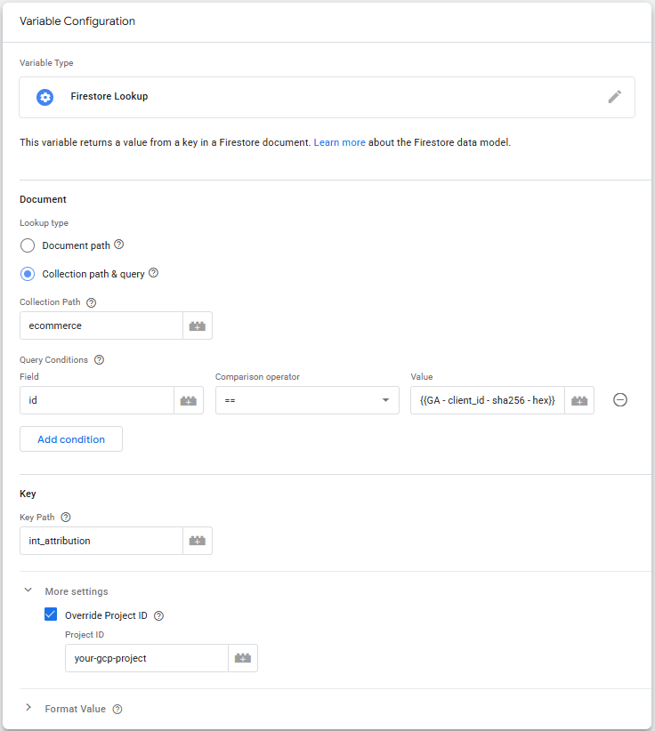
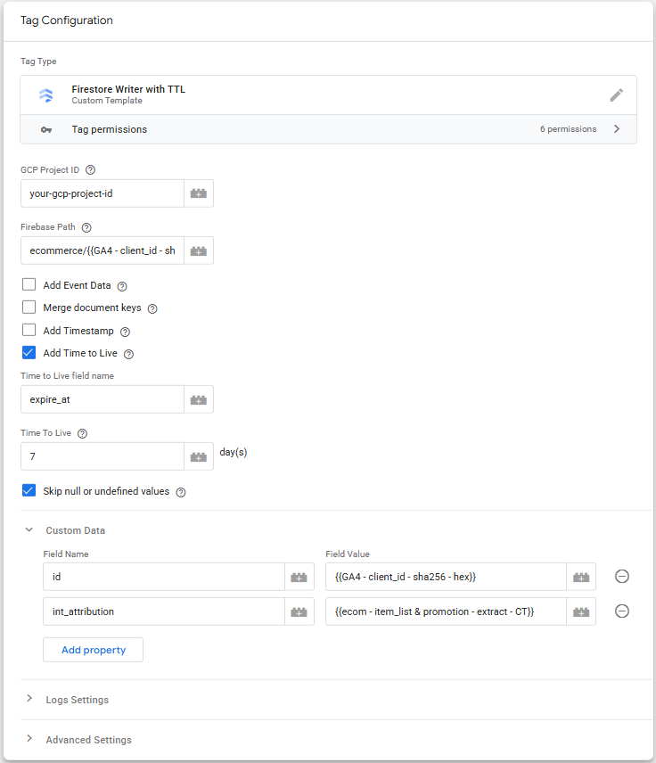

# Google Cloud & Firestore Setup
If you want an easier understanding of cost, it’s recommended to create a **[new Google Cloud Project](https://console.cloud.google.com/projectcreate)** for the Firestore setup.

##  Firestore Setup  
* Select a [Cloud Firestore mode](https://console.cloud.google.com/firestore/welcome)
  * Select Native Mode
* Choose where to store your data
  * Create Database

If you are running Firestore in a different Google Cloud Project than Server-side GTM, you must add the **[SGTM service account](https://console.cloud.google.com/iam-admin/serviceaccounts)** to the **[Firestore project via IAM](https://console.cloud.google.com/iam-admin/iam)**.

Grant the service account a **Cloud Datastore User role** to give SGTM access to the Firestore project.

* If Server-side GTM is running on App Engine, add the Server-side GTM **App Engine default service account** to the Firestore project.
* If Server-side GTM is running on Cloud Run, add the Server-side GTM **Compute Engine default service account** to the Firestore project.

### Delete outdated documents in Firestore
* Use **[time-to-live (TTL) policies](https://cloud.google.com/firestore/docs/ttl)** to automatically delete outdated documents.

In Firestore, go to **[Time to live (TTL)](https://console.cloud.google.com/firestore/ttl)**.
* Click **Create Policy**
* **Collection group**: ecommerce
* **Timestamp field**: expire_at
* Click **Create** button

## Server-side GTM Setup

### Quick Setup

1. Create a new **Workspace** in Server-side GTM
2. Import [**SGTM-container-Firestore.json**](SGTM-container-Firestore.json) to this Workspace
    * **Choose an import option:** Merge
	    * Rename conflicting clients, tags, transformations, triggers and variables.
3. Adjust the imported **Clients** to fit your setup
    * GA4
4. Adjust the imported **GA4 Tag** to fit your setup
5. Other adjustments is up to you. You will maybe have to clean up conflicting Tags, Variables and Triggers.

### Manual Setup
Install the following Server-side GTM Templates:
* [**GA4 - Item List & Promotion Attribution**](https://tagmanager.google.com/gallery/#/owners/gtm-templates-knowit-experience/templates/sgtm-ga4-ecom-item-list-promo-attribution) (this Variable Template)
* [**Firestore Writer with TTL Tag**](https://github.com/gtm-templates-knowit-experience/sgtm-firestore-writer-with-ttl-tag)
    * At the time of writing, this Tag is not vailable in Google Tag Manager Template Gallery.
* [**sha256 Hasher**](https://tagmanager.google.com/gallery/#/owners/gtm-templates-simo-ahava/templates/sha256-hasher) Variable

#### Create Variables
We must create some Variables. Suggested Variable names are listed below, and are also used throughout the documentation.
*	ecom - attribution time - minutes - C
*	GA - client_id - ED
*	GA - client_id - sha256 - hex
*	ecom - items - item_list & promotion - Firestore - FL
*	ecom - items - item_list & promotion - extract - CT
*	ecom - items - item_list & promotion - merge - CT
*	++

### ecom - attribution time - minutes - C
As standard, attribution time is the same as a **[GA4 Session](https://support.google.com/analytics/answer/9191807)**, but you can choose a **Custom Attribution Time** if that better fits your users behaviour.

Create this variable if you are going to use **Custom Attribution Time**.

Since attribution time is referenced in several variables, it’s recommended to create a Constant Variable with the attribution time in minutes.
How long the custom attribution time should be is up to you. Time is counted from the last **select_promotion**, **select_item** or **add_to_cart** Event. 

* Name the Variable **ecom - attribution time - minutes - C**.

### GA - client_id - ED
The Client Id is going to be used as an identifier in this solution.
Create an **Event Data** Variable and add **client_id** as **Key Path**.

-client_id-ED.png)

*	Name the Variable **GA - client_id - ED**.

### GA - client_id - sha256 - hex
With Server-side GTM, the **Client ID** can sometimes come from the **_ga** cookie, and other times from the **FPID** cookie if you have chosen **Migrate from JavaScript Managed Client ID** in SGTM. Client ID from the FPID cookie can sometimes contain / (slash). An id with a slash can’t be a document in Firestore (the document would be broken).

To get around this potential issue, we **hash the Client ID encoded as hex**. Create a **sha256 Hasher** Variable, and **Value to hash** should be **{{GA - client_id - ED}}**.

In addition, using data pseudonymization or anonymization when you can is always a good thing.

-client_id-sha256-hex.png)

* Name the Variable **GA - client_id - sha256 - hex**.

### ecom - items - item_list & promotion - Firestore - FL
We are using the **Firestore Lookup** to read data from Firestore. You can query Firestore using either **Document Path**, or **Collection & query**. We are using Collection & query simply because this will not throw any warnings in Server-side GTM Preview if you query an id that doesn’t exist (yet).
How to name and organize your Firestore document is up to you, but these are the settings used in this example:

*	**Document Path:** ecommerce
*	**Field:** _id ==_ {{GA - client_id - sha256 - hex}}
*	**Key Path:** int_attribution
*	**Project ID:** _Your GCP Project ID_

* Name the Variable **ecom - items - item_list & promotion - Firestore - FL**.

### ecom - items - item_list & promotion - extract - CT
Select the **GA4 Ecommerce – Item List & Promotion Attribution** Variable (this Template). This variable will **extract Item List & Promotion dat**a from GA4 Ecommerce and create the attribution. With other words, attribution happens at collection time.

This variable will do both Firestore Read and Write.

*	**Variable Type:** Extract Item Lists & Promotion for Attribution
*	**Second Data Source:** {{ecom - items - item_list & promotion - Firestore - FL}}
* Attribution
  * **Delete Attribution Data after Purchase:** Tick this box to delete/reset attribution data after a purchase has happened.
    * You only need this setting for the Variable that attribute Items. Not necessary for Event-level attribution Variables.
  * **Custom Attribution Time:** Tick this box if you are using **Custom Attribution Time**
    * **Attribution Time in Minutes:** {{ecom - attribution time - minutes - C}}
  * **Attribution Type:** Select Last or First Click Attribution
* Site Search
  * **Attribute Site Search:** Tick this box if you want to attribute **search_term**.
  * **Lower Case Search Term:** Tick this box if you want to _lowercase_ **search_term**.
* Other Settings
  * **Handle data as string:** This will save attribution data as a string. Not relevant when using Firestore.
  * **Limit Items:** This will limit number of Items stored. Not relevant when using Firestore.

* Name the Variable **ecom - items - item_list & promotion - extract - CT**.

### ecom - items - item_list & promotion - merge - CT

Select the **GA4 Ecommerce – Item List & Promotion Attribution Variable** (this Template). This Variable merges Implemented data & data from Second Data Source (Firestore).

* **Variable Type:** Return Attributed Output
* **Output:** Items
* **Add Search Terms To Items:** If you tick this checkbox, **search_term** will be added to **items**. This makes it easier to report search_term related to items. You must create an **Item scoped Dimension** in GA4.
  * This selection is only available for **Items**
* **Second Data Source:** {{ecom - items - item_list & promotion - Firestore - FL}}
* Attribution
  * **Custom Attribution Time** Tick this box if you are using **Custom Attribution Time**
    * **Attribution Time in Minutes:** {{ecom - attribution time - minutes - C}}

*	Name the Variable **ecom - items - item_list & promotion - merge - CT**.

In addition, you must create **Promotion & Search Term Variables** using the same Variable Type if you have implemented **Promotion without Items**, or if you want to attribute **Search Term**:

| Variable Name  | Output |
| ------------- | ------------- |
| ecom - location_id - merge - CT | Location ID |
| ecom - promo - creative_name - merge - CT | Creative Name |
| ecom - promo - creative_slot - merge - CT | Creative Slot |
| ecom - promo - promotion_id - merge - CT | Promotion ID |	
| ecom - promo - promotion_name - merge - CT | Promotion Name |	
| ecom - search_term - merge - CT | Search Term |	

## Trigger
### ecom - Attribute Events - Item List & Promotion

Create a Custom Trigger Type with the following settings:  
* **This trigger fires on:** Some Events
* **Client Name** _equals_ GA4 (the name you have given your GA4 Client)
* **Event Name** *matches RegEx* ^(select_item|select_promotion|add_to_cart|purchase)$
  * **purchase** Event in RegEx is only needed if you want to delete/reset attribution data after purchase
  *  If you are going to attribute **search_term** as well, RegEx should be **Event Name** *matches RegEx* ^(select_item|select_promotion|add_to_cart|purchase|view_search_results)$
* **ecom - items - item_list & promotion - extract - CT** _does not equal_ undefined

*	Name the Trigger **ecom - Attribute Events - Item List & Promotion**.

## Tags

### GA4 - Item List & Promotion Attribution - Firestore TTL
Select the [**Firestore Writer with TTL** Tag](https://github.com/gtm-templates-knowit-experience/sgtm-firestore-writer-with-ttl-tag), and add the following settings:

* **GCP Project ID:** your-gcp-project-id
* **Firestore Path:** ecommerce/{{GA - client_id - sha256 - hex}}
* Add Time to Live
  * **Time to Live field name:** expire_at
  * **Time To Live:** 7
* Custom Data
  * **Field Name:** int_attribution
	* **Field Value:** {{ecom - items - item_list & promotion - extract - CT}}
  * **Field Name:** id
	* **Field Value:** {{GA - client_id - sha256 - hex}}

* Add **ecom - Attribute Events - Item List & Promotion** as a **Trigger** to the Tag.

## Transformations

### GA4 - Ecom - Item List & Promotion - Augment

* Select the **Augument Event Transformation**

#### Parameters to Augment
| Name  | Value |
| ------------- | ------------- |
| items | {{ecom - items - item_list & promotion - merge - CT}} |
| promotion_name | {{ecom - promo - promotion_name - merge - CT}} |
| promotion_id | {{ecom - promo - promotion_id - merge - CT}} |
| creative_name | {{ecom - promo - creative_name - merge - CT}} |	
| creative_slot | {{ecom - promo - creative_slot - merge - CT}} |	
| search_term | {{ecom - search_term - merge - CT}} |	

#### Matching conditions

* **{{Event Name}}** _matches RegEx_ ^(purchase|add_payment_info|add_shipping_info|begin_checkout|view_cart|add_to_cart|remove_from_cart|add_to_wishlist|view_item)$

#### Affected tags

* Some Tags
    * **Included tags:** GA4

Your Server-side GTM setup is now complete.

## Estimating cost
### Firestore
At the time of creating this solution, **50,000 Document Reads**, **20,000 Document Writes** and **20,000 Document Deletes** are free per day. See **[Firestore pricing](https://cloud.google.com/firestore/pricing)** for complete information.

Estimating potential cost is difficult, so use these numbers as a rough guidance.

#### Firestore Write
Number of writes would be around the same count of select_item, select_promotion and add_to_cart. If you use Cloud Functions to rewrite **expire_at**, estimate the count to be almost doubled.

#### Firestore Read
Number of Reads is difficult to estimate. Sum all GA4 Events that Reads from Firestore, and multiply that with 5-8. If you use Cloud Functions to rewrite **expire_at**, the coundt can be more than doubled.

#### Firestore Delete
This depends on how miuch traffic you have (more users equals more data stored), how often users return, and how many days you store the data in Firestore. Expect this to be the lowest Firestore cost.

### Server-side GTM
Server-side GTM cost will also be affected since attribution requires SGTM to do the processing.

Solution by [**Knowit AI & Analytics**](https://www.knowit.no/) (Oslo, Norway). Not officially supported by Knowit.