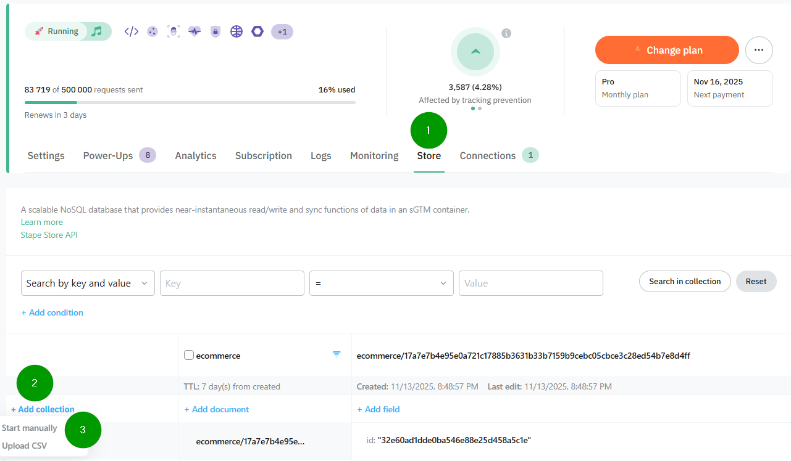
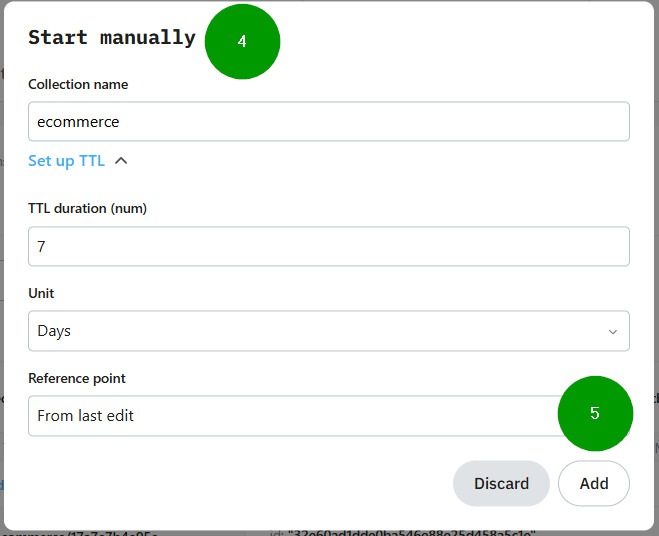
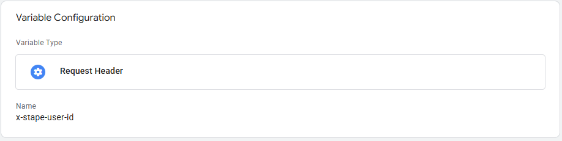
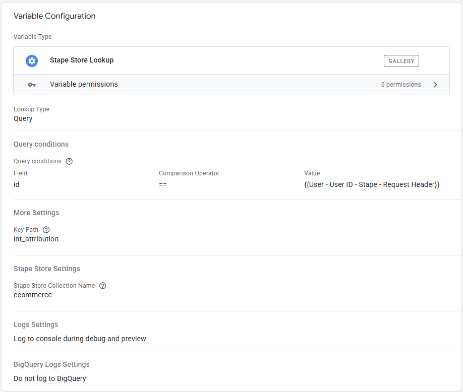
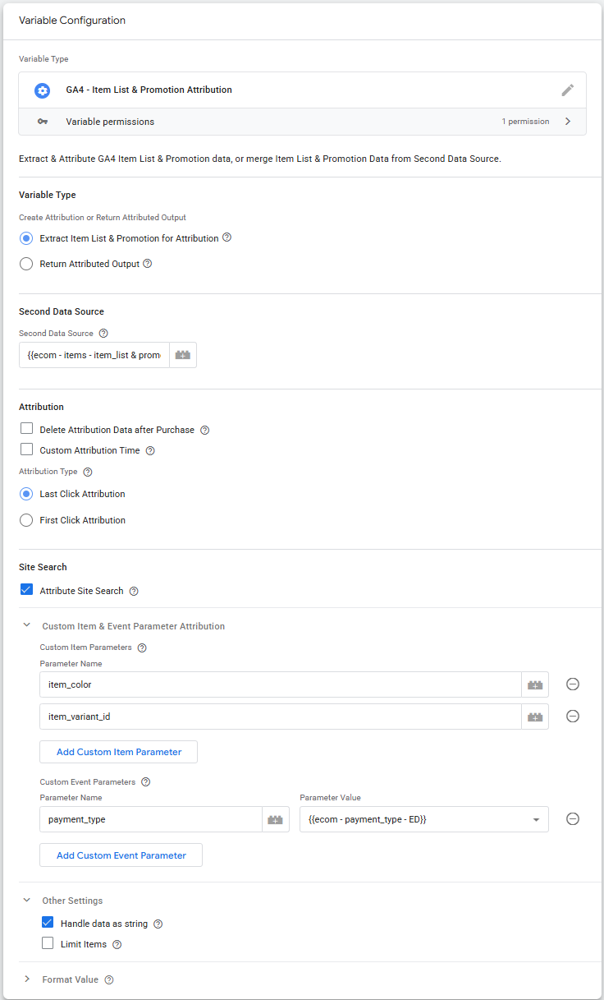
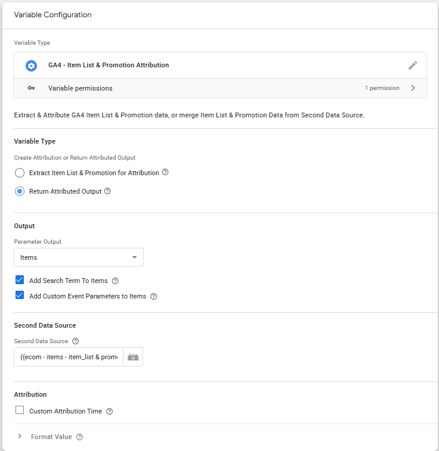
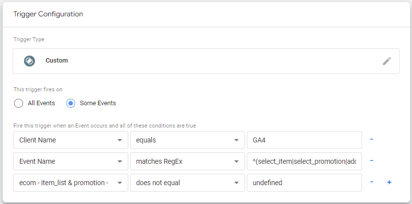
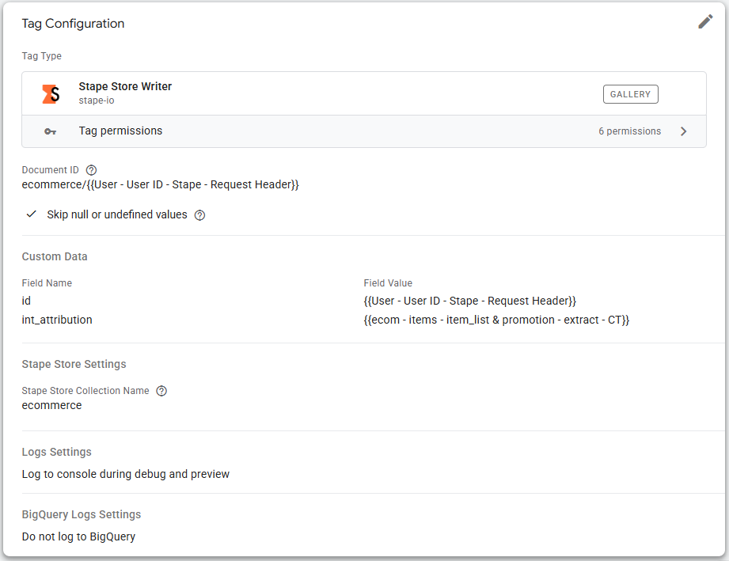
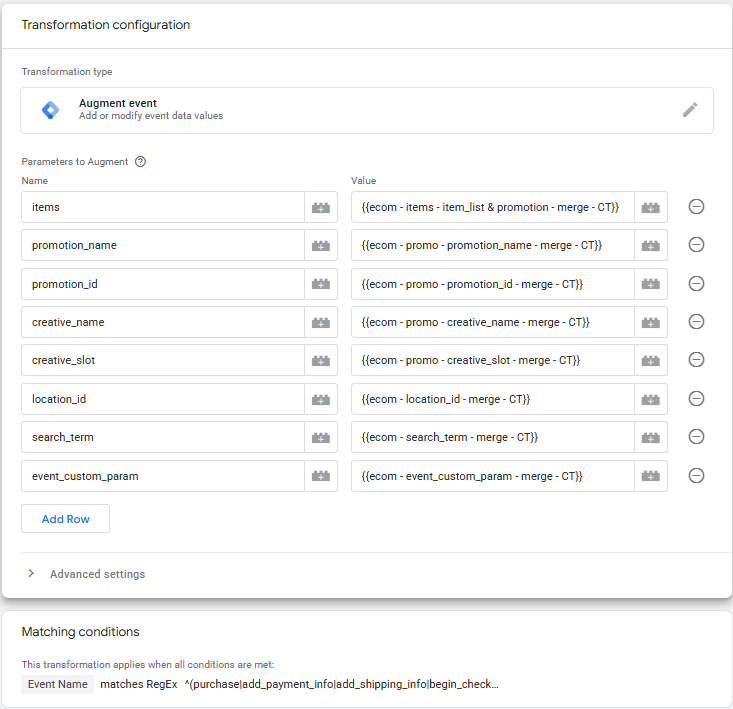

# Stape Setup
[Stape Store](https://stape.io/helpdesk/documentation/stape-store-feature?pt=vsahefle&rs=site&rr=eu) is available for **Stape customers** with a Pro or higher plan at no additional cost at the time of writing.

## Stape Store Setup 
1. After you have logged in to your Stape account, go to **Store**.
2. Click **Add collection**.
3. Select **Start manually**.
4. Start manually settings:
	* **Collection name**: ecommerce
	* **TTL duration**: 7
		* This is how long the document will live before it is automatically deleted. I use 7 days, but set what suit you best.
	* **Unit**: Days
	* **Reference point**: From last edit
5. **Add**

Stape Store setup completed.

## Power-Ups
We need to use an identificator (ID) in Stape Store. One solution is to use the [**Stape User ID**](https://stape.io/solutions/user-id?pt=vsahefle&rs=site&rr=eu).
Another solution is to user **GA4 Client ID** as described in the [**Firestore setup**](../01-Firestore/README.md#ga---client_id---ed).

In this documentation we will use Stape User ID.

* To enable User ID in your Stape account, choose Power-Ups, choose **User ID** and click **Use** button. 

# Server-side GTM Setup

## Quick Setup

1. Create a new **Workspace** in Server-side GTM
2. Import [**SGTM-container-Stape.json**](SGTM-container-Stape.json) to this Workspace
    * **Choose an import option:** Merge
	    * Rename conflicting clients, tags, transformations, triggers and variables.
3. Adjust the imported **Clients** to fit your setup
    * GA4
4. Adjust the imported **GA4 Tag** to fit your setup
5. Other adjustments is up to you. You will maybe have to clean up conflicting Tags, Variables and Triggers.

## Manual Setup
Install the following Server-side GTM Templates:
* [**GA4 - Item List & Promotion Attribution**](https://tagmanager.google.com/gallery/#/owners/gtm-templates-knowit-experience/templates/sgtm-ga4-ecom-item-list-promo-attribution) (this Variable Template)
* [**Stape Store Writer**](https://tagmanager.google.com/gallery/#/owners/stape-io/templates/stape-store-writer-tag) (Tag)
* [**Stape Store Lookup**](https://tagmanager.google.com/gallery/#/owners/stape-io/templates/stape-store-lookup-variable) (Variable)

### Create Variables
We must create some Variables. Suggested Variable names are listed below, and are also used throughout the documentation.
*	ecom - attribution time - minutes - C
*	User ID - Stape - Request Header
*	ecom - items - item_list & promotion - Stape Lookup
*	ecom - items - item_list & promotion - extract - CT
*	ecom - items - item_list & promotion - merge - CT
*	++

#### ecom - attribution time - minutes - C
As standard, attribution time is the same as a **[GA4 Session](https://support.google.com/analytics/answer/9191807)**, but you can choose a **Custom Attribution Time** if that better fits your users behaviour.

Create this variable if you are going to use **Custom Attribution Time**.

Since attribution time is referenced in several variables, it’s recommended to create a Constant Variable with the attribution time in minutes.
How long the custom attribution time should be is up to you. Time is counted from the last **select_promotion**, **select_item** or **add_to_cart** Event. 

* Name the Variable **ecom - attribution time - minutes - C**.

#### Stape User ID
The Stape User ID is going to be used as an identifier in this setup.

Create an **Request Header** Variable and add **x-stape-user-id** as **Name**.

*	Name the Variable **User ID - Stape - Request Header**.

### ecom - items - item_list & promotion - Stape Lookup
We are using the **Stape Lookup** to read data from Stape Store. You can query Stape Store using either **Document ID**, or **Query**.

How to name and organize your Stape Store document is up to you, but these are the settings used in this example:

*	**Lookup Type'': Query
*	**Stape Store Collection Name:** ecommerce
*	**Field:** _id ==_ {{User ID - Stape - Request Header}}
*	**Key Path:** int_attribution
*	**Store the result in cache:** _Leave unchecked_
*	**Use the Stape Store database of a different container:** _false_

* Name the Variable **ecom - items - item_list & promotion - Stape Lookup**.

### ecom - items - item_list & promotion - extract - CT
Select the **GA4 Ecommerce – Item List & Promotion Attribution** Variable (this Template). This variable will **extract Item List & Promotion dat**a from GA4 Ecommerce and create the attribution. With other words, attribution happens at collection time.

This variable will do both Stape Store Read and Write.

*	**Variable Type:** Extract Item Lists & Promotion for Attribution
*	**Second Data Source:** {{ecom - items - item_list & promotion - Stape Lookup}}
* Attribution
  * **Delete Attribution Data after Purchase:** Tick this box to delete/reset attribution data after a purchase has happened.
    * You only need this setting for the Variable that attribute Items. Not necessary for Event-level attribution Variables.
  * **Custom Attribution Time:** Tick this box if you are using **Custom Attribution Time**
    * **Attribution Time in Minutes:** {{ecom - attribution time - minutes - C}}
  * **Attribution Type:** Select Last or First Click Attribution
* Site Search
  * **Attribute Site Search:** Tick this box if you want to attribute **search_term**.
  * **Lower Case Search Term:** Tick this box if you want to _lowercase_ **search_term**.
* Other Settings
  * **Handle data as string:** This will save attribution data as a string. Not relevant when using Stape Store.
  * **Limit Items:** This will limit number of Items stored. Not relevant when using Stape Store.

* Name the Variable **ecom - items - item_list & promotion - extract - CT**.

### ecom - items - item_list & promotion - merge - CT

Select the **GA4 Ecommerce – Item List & Promotion Attribution Variable** (this Template). This Variable merges Implemented data & data from Second Data Source (Stape Store).

* **Variable Type:** Return Attributed Output
* **Output:** Items
* **Add Search Terms To Items:** If you tick this checkbox, **search_term** will be added to **items**. This makes it easier to report search_term related to items. You must create an **Item scoped Dimension** in GA4.
  * This selection is only available for **Items**
* **Second Data Source:** {{ecom - items - item_list & promotion - Stape Lookup}}
* Attribution
  * **Custom Attribution Time** Tick this box if you are using **Custom Attribution Time**
    * **Attribution Time in Minutes:** {{ecom - attribution time - minutes - C}}

*	Name the Variable **ecom - items - item_list & promotion - merge - CT**.

In addition, you must create **Promotion & Search Term Variables** using the same Variable Type if you have implemented **Promotion without Items**, or if you want to attribute **Search Term**:

| Variable Name  | Output |
| ------------- | ------------- |
| ecom - location_id - merge - CT | Location ID |
| ecom - promo - creative_name - merge - CT | Creative Name |
| ecom - promo - creative_slot - merge - CT | Creative Slot |
| ecom - promo - promotion_id - merge - CT | Promotion ID |	
| ecom - promo - promotion_name - merge - CT | Promotion Name |	
| ecom - search_term - merge - CT | Search Term |	

## Trigger
### ecom - Attribute Events - Item List & Promotion

Create a Custom Trigger Type with the following settings:  
* **This trigger fires on:** Some Events
* **Client Name** _equals_ GA4 (the name you have given your GA4 Client)
* **Event Name** *matches RegEx* ^(select_item|select_promotion|add_to_cart|purchase)$
  * **purchase** Event in RegEx is only needed if you want to delete/reset attribution data after purchase
  *  If you are going to attribute **search_term** as well, RegEx should be **Event Name** *matches RegEx* ^(select_item|select_promotion|add_to_cart|purchase|view_search_results)$
* **ecom - items - item_list & promotion - extract - CT** _does not equal_ undefined

*	Name the Trigger **ecom - Attribute Events - Item List & Promotion**.

## Tags

### GA4 - Item List & Promotion Attribution - Stape Store Writer
Select the [**Stape Store Writer** Tag](https://tagmanager.google.com/gallery/#/owners/stape-io/templates/stape-store-writer-tag), and add the following settings:

* **Document ID:** ecommerce/{{User - User ID - Stape - Request Header}}
* **Skip null or undefined values:** ✅
* Custom Data
  * **Field Name:** int_attribution
	* **Field Value:** {{ecom - items - item_list & promotion - extract - CT}}
  * **Field Name:** id
	* **Field Value:** {{User - User ID - Stape - Request Header}}

* Add **ecom - Attribute Events - Item List & Promotion** as a **Trigger** to the Tag.

## Transformations

### GA4 - Ecom - Item List & Promotion - Augment

* Select the **Augument Event Transformation**

#### Parameters to Augment
| Name  | Value |
| ------------- | ------------- |
| items | {{ecom - items - item_list & promotion - merge - CT}} |
| promotion_name | {{ecom - promo - promotion_name - merge - CT}} |
| promotion_id | {{ecom - promo - promotion_id - merge - CT}} |
| creative_name | {{ecom - promo - creative_name - merge - CT}} |	
| creative_slot | {{ecom - promo - creative_slot - merge - CT}} |	
| search_term | {{ecom - search_term - merge - CT}} |	

#### Matching conditions

* **{{Event Name}}** _matches RegEx_ ^(purchase|add_payment_info|add_shipping_info|begin_checkout|view_cart|add_to_cart|remove_from_cart|add_to_wishlist|view_item)$

#### Affected tags

* Some Tags
    * **Included tags:** GA4

Your Server-side GTM setup is now complete.

Solution by [**Knowit AI & Analytics**](https://www.knowit.no/) (Oslo, Norway). Not officially supported by Knowit.
