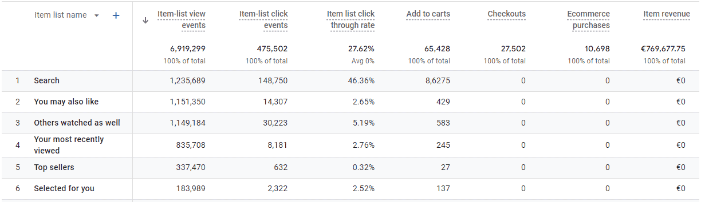
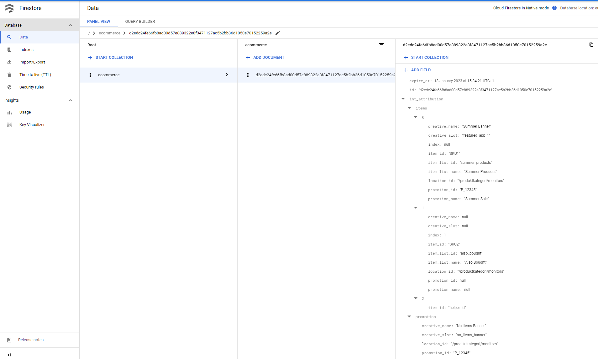
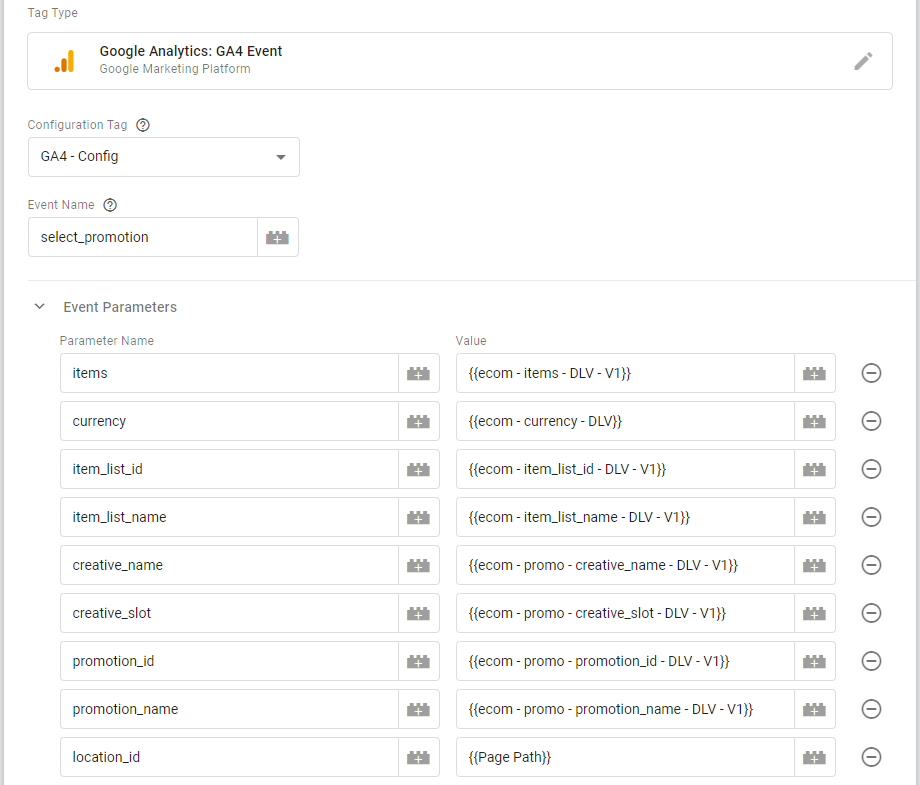
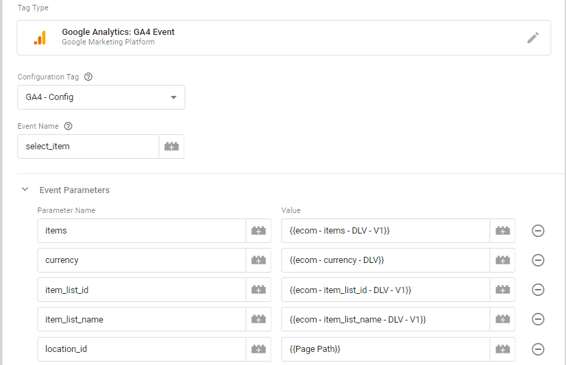
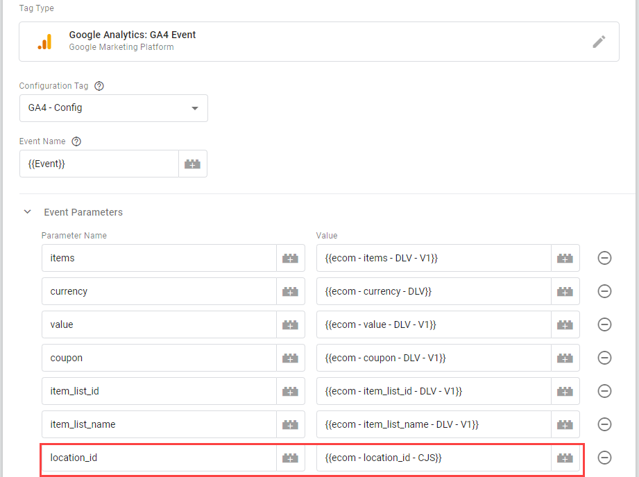

# GA4 - Item List & Promotion Attribution - SGTM Variable (Server)
**Google Analytics 4 (GA4)** has **Item List & Promotion reports**. But - no revenue or conversions are attributed back to Promotion or Item Lists. You have to do this attribution yourself.

This Variable for  **Server-side GTM** makes it possible to attribute **GA4 Item List**, **Promotion** & **Search Term** to revenue or Ecommerce Events (ex. purchase) & Items:
* Last Click Attribution
* First Click Attribution
* Reset/delete Attribution Data after Purchase
* Attribution Time (for how long should Item List or Promotion be attributed)
  * Attribution Time can be either **GA4 Session** or **Custom Attribution Time**

This Template is available in the **[Google Tag Manager Template Gallery](https://tagmanager.google.com/gallery/#/owners/gtm-templates-knowit-experience/templates/sgtm-ga4-ecom-item-list-promo-attribution)**.

A similar [Variable Template do also exist for **GTM (Web)**](https://github.com/gtm-templates-knowit-experience/gtm-ga4-ecom-item-list-promo-attribution). Differences between doing the attribution with GTM (Web) vs. Server-side GTM (SGTM) are listed below.

| Functionality  | GTM (Web) | Server-side GTM |
| ------------- | ------------- | ------------- |
| Cross (sub)domain tracking | No * | Yes |
| Server to Server-side (Measurement Protocol) | No | Yes |
| Attribution/processing | Users browser | Server-side |
| Storage Limitation | Yes | No |
| Costs Money | No | Yes |

\* Cookies can do cross subdomain tracking, but are not very suitable due to very low storage capasity.

## Attribution solutions

2 different solutions for handling the attribution are presented:

1. [**Firestore** solution](01-Firestore):
	* [Firestore](https://cloud.google.com/firestore/) is a serverless, NoSQL document database from **Google**.
2. [**Stape Store** solution](02-Stape-Store):
	* [Stape Store](https://stape.io/solutions/stape-store?pt=vsahefle&rs=site&rr=eu) is a serverless, NoSQL document database from [**Stape**](https://stape.io?pt=vsahefle&rs=site&rr=eu).
		* If you are running Server-side GTM using Stape, Stape Store is recommended.

Firestore data example below.

## Attribution explained

This solution can do either **Last Click** or **First Click Attribution**.

Attribution happens on 2 levels: 
1. Event-level
    - Promotion without Items
    - Search Term
2. Item-level
    - Implemented Items data (ex. Item List name) trumps attributed Items data. Ex. if you are adding a Item to cart directly from a Item List, the implemented Item List Name will be used. If you are adding the Item to cart from a product page (where you shouldn't have a Item List implemented), the attributed Item List Name will be used.
	- Item Scoped Item List & Promotion attribution are independent of each other. 

* Item-level trumps the Event-level.
  * Promotion without Items will not be attributed to a Item when Promotion with Items are attributed 

To get a better understanding of the attribution, it's recommended to run some test scenarios where you inspect your own data:
* Run **Server-side GTM** in **Preview Mode**
* Look at the **Firestore** data being built or rewritten
* Inspect especially **Items** in **GA4 DebugView**

### Last Click Attribution
With a Last Click Attribution model, this user journey illustrates the attribution:
1. User clicks on “**Promotion 1 without Items**” (promotion without any Items attached to the promotion). This is an Event-level promotion, and “Promotion 1 without Items” is the attributed Event-level promotion.
    - On the “Promotion 1 without Items” page, there is a “**Promotion 2 without Items**” promotion, and the user clicks on the promotion. This promotion is also an Event-level promotion. “Promotion 2 without Items” is now attributed to the Event-level promotion.
2. The user clicks next on a promotion for a bundled phone with earbuds package (“**Promotion 3 with Items**”). This promotion has 2 items attached, the phone and the earbuds. This promotion is attached to the 2 different Item Id’s (**item_id = phone1** and **item_id = earbud2**) and is therefore an Item-level promotion. 
   -	User adds this bundle with 2 items to cart. The add_to_cart Event is attributed to the promotion.
      - User clicks after that on the “**Users Also Looked At**” Item List with other earbuds that it’s also possible to choose. The earbud (item_id = earbud3) the user clicked on is attributed to the “Users Also Looked At” item list. 
        - On this page, there is also an “Users Also Looked At” item list. User clicks on the first selected earbud (**item_id = earbud2**). The earbud is now attributed to the “Users Also Looked At” item list, but is still attributed to the initial Item-level promotion. This because Item Lists and Promotion attribution are independent.
3. User completes the purchase, and GA4 adds some logic to the result, namely that Item-level trumps the Event-level.
    - The phone (**item_id = phone1**) is attributed to the “**Promotion 3 with Items**” promotion. The promotion didn’t have any Item List, so no Item Lists are attributed. If the promotion also had an Item List, this list would have been attributed.
    - The earbud (**item_id = earbud2**) is attributed to the “**Users Also Looked At**” item list, but in addition, since this item doesn’t have any Item-level promotion, the Event-level promotion “**Promotion 2 without Items**” is also attributed to the earbud. 
      - Since Item-level trumps Event-level, “**Promotion 2 without Items**” is not attributed to the phone, since this has an Item-level promotion attributed.

### First Click Attribution
In the same scenario, but using First Click Attribution, this would be the result:

1.	Both the phone (**item_id = phone1**) and the earbud (**item_id = earbud2**) would both be attributed to the Item-level “**Promotion 3 with Items**” bundle promotion.
    - “**Users Also Looked At**” item list would also be attributed to the sale, since Item Scoped Item Lists & Promotion are independent.
    - None of the Event-level promotions “**Promotion 1 without Items**” or “**Promotion 2 without Items**” would be attributed since Item-level trumps Event-level.

## Web implementation
To make the attribution work, also the implementation on the website must be correct. It’s especially implementation of Item List that can be incorrect.

**All attribution in this solution is tied back to the following Events:**
*	select_item, add_to_cart (from a list) or select_promotion

When it comes to filling out the **location_id** parameter, if you don’t have **Place ID** as Google suggest using, fill this parameter with **Page Path** instead. Then you will get Page Path attributed as well.

The GA4 Event documentation allows for implementation of Item List and Promotion on both the Event-level and Item-level. This Template supports both implementations.

### Promotion implementation
It’s recommended to implement all promotion parameters, but as a minimum for this attribution to work you must implement either **promotion_id** or **promotion_name** with the **[select_promotion](https://developers.google.com/analytics/devguides/collection/ga4/reference/events#select_promotion)** Event.

### Item List Implementation

The following Events should have Item List implemented. The rest of the ecommerce Events will read the Item List data using this Template.
*	[view_item_list](https://developers.google.com/analytics/devguides/collection/ga4/reference/events#view_item_list)
* [select_item](https://developers.google.com/analytics/devguides/collection/ga4/reference/events#select_item)
* [add_to_cart](https://developers.google.com/analytics/devguides/collection/ga4/reference/events#add_to_cart)

Implementing Item List for the **add_to_cart** Event has though an exception. Item Lists should only be implemented if the Item is added to cart directly from an Item List. 

You should never implement a **Product Page Item List**. The reason for this is that this will overwrite the Item List the user arrived from (ex. a “Related Products” list), and you will not be able to tell how well the “Related Products” list is working in terms of sales.

## GTM (Web) Setup
To make the attribution work, the **GTM (Web)** setup must also be correct.

In the examples below, the setup handles implementation both on the Event-level and Item-level.

In the setup you will see that Data Layer is mostly Version 1. The **[GA4 Ecom Items - DLV Version 1](https://github.com/gtm-templates-knowit-experience/gtm-ga4-ecom-items-dlv-version-1-variable)** Variable Template is used for achieving that.

### select_promotion & view_promotion
This setup handles both **select_promotion** & **view_promotion**, where promotion also has **Event-level Item Lists**. **location_id** is set to **Page Path**.

### select_item & view_item_list
This setup handles both **select_item** & **view_item_list**, with **Event-level Item Lists**. **location_id** is set to **Page Path**.

### add_to_cart & view_item
This setup handles **add_to_cart** & **view_item**. **location_id** in this setups is also **Page Path**, but Page Path will only be returned if **item_list_name** or **item_list_id** exist. Otherwise **location_id** will be **undefined**.

Solution by [**Knowit AI & Analytics**](https://www.knowit.no/) (Oslo, Norway). Not officially supported by Knowit.